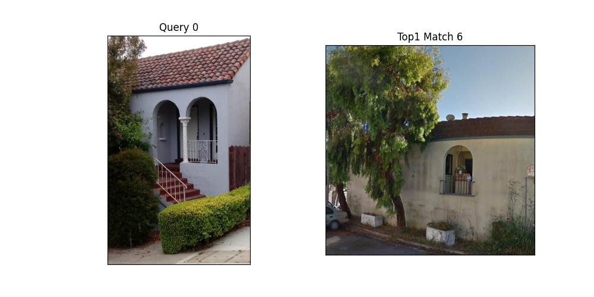
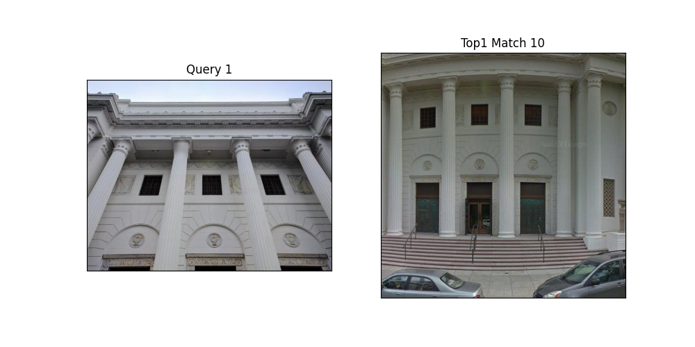
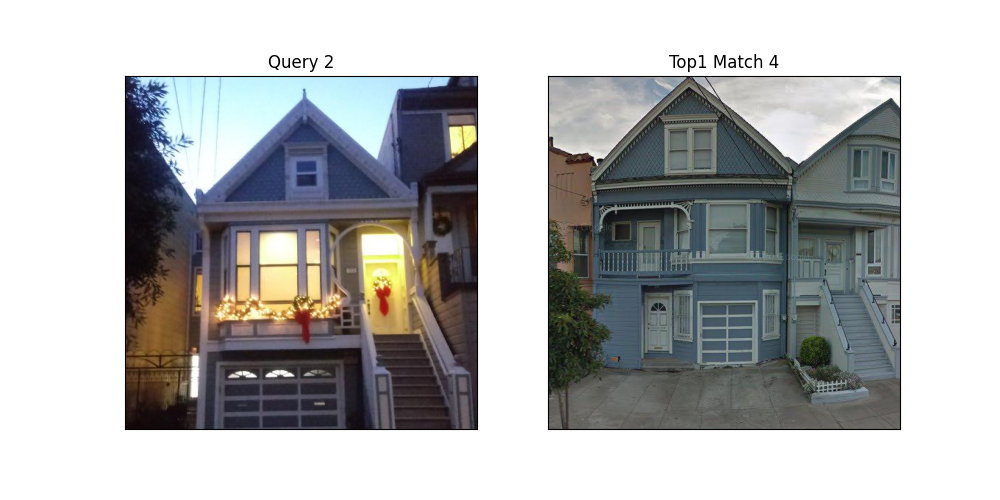
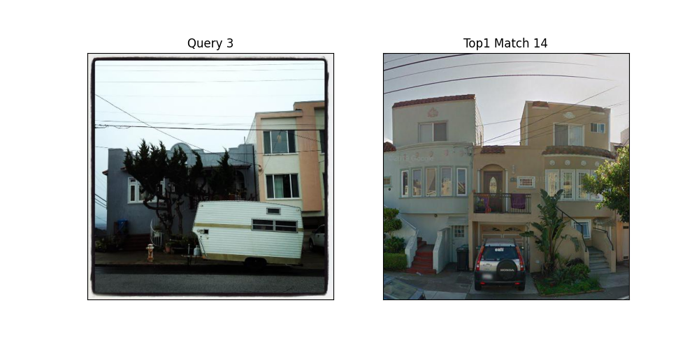
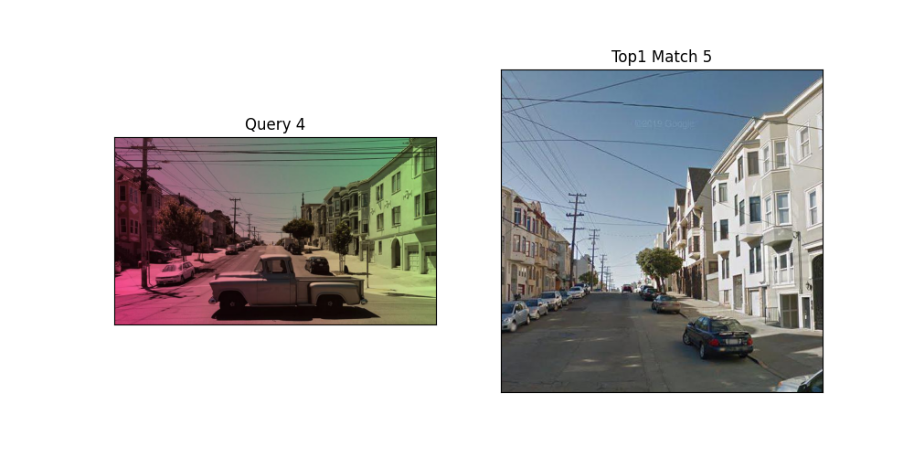

# NetVLAD_torch_hub
This repo provides support for using NetVLAD for inference only purpose with a single line of code (aka torch hub).

## Install Depends
```bash
pip install -r requirements.txt
```

## Example Usage
```python
model = torch.hub.load("jarvisyjw/netvlad", 'my_model', model_name=VGG16-NetVLAD-Pitts30K, whiten=True)
```
- A retrieval example is provided in `test_model.py`
```bash
python test_model.py
```
Gives results:











## Acknowledgement
[HLoc](https://github.com/cvg/Hierarchical-Localization), [VPR-methods-evaluation](https://github.com/gmberton/VPR-methods-evaluation)